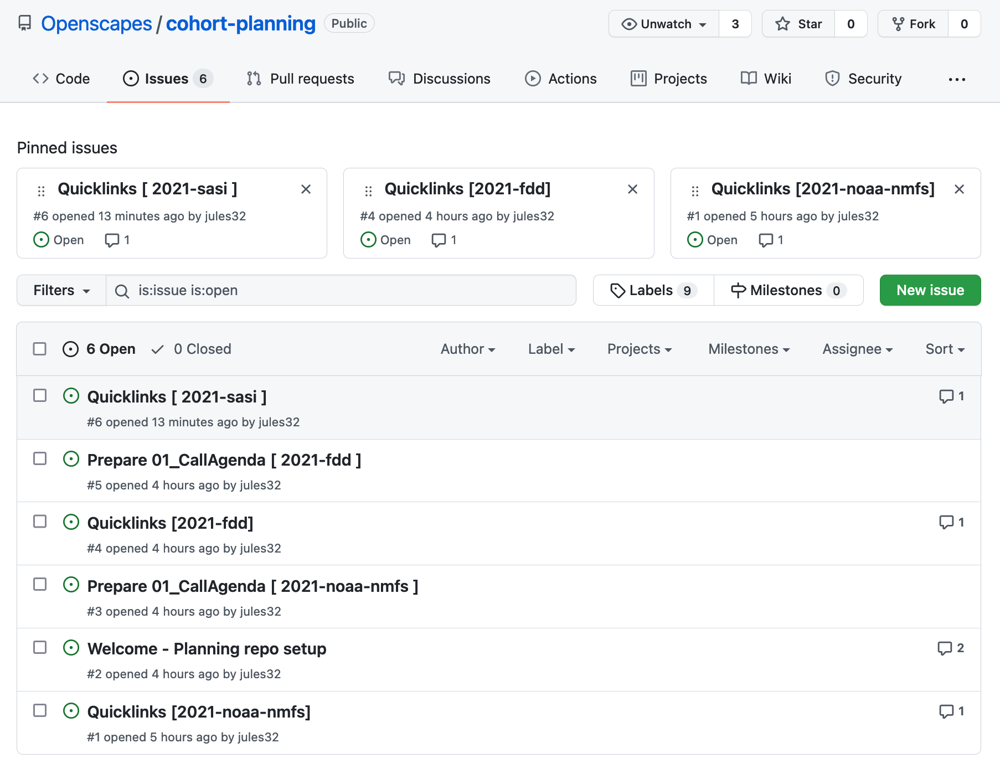
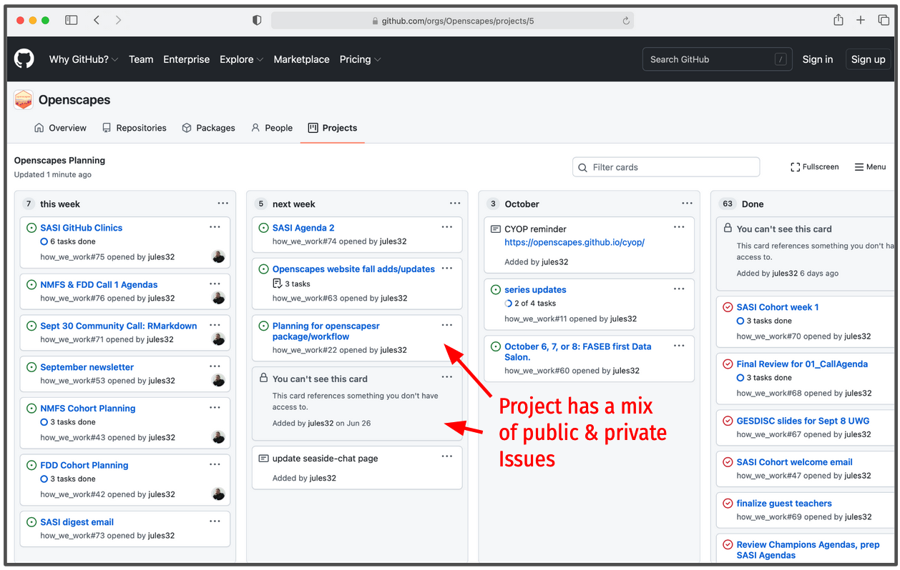

## Welcome to the team! 

As we start collaborating with folks to deliver the Champions Program we will be documenting the onboarding process here. We are onboarding folks to collaborate in different capacities — i.e. as mentors, assistants, evaluators, lesson contributors, guest teachers — so we will be trying to be as streamlined as possible with the most relevant information and skill-building to meet specific needs and timeframes. We are excited for more communities to be able to use the Openscapes approach! 

## First Introductions

To first get a sense of Openscapes, we recommend looking through [openscapes.org](https://openscapes.org), including some of the slides listed on the [approach](https://openscapes.org/approach) and [champions](https://openscapes.org/champions) pages. This will help give you an overview of Openscapes as a whole and of the Champions Program.

## Experience a Cohort Call

The next step is to experience the Cohort Calls to see what they are really like. Hopefully this can happen live, but if not we'll give you access to an example folder of [Openscapes_CohortCalls](https://drive.google.com/drive/folders/1JaQ3Dkrr7pUfesSaxqRqntGlxG0dz2nl?usp=sharing). The folder has four 1.5-hour videos and associated agendas, as well as the drafted blog post. We suggest you: 

- Read the blog post to get an overview
- Watch a `CallRecording` while at the same time reading through the accompanying `CallAgenda` (we'll let you know which one we recommend). We use the Agendas for live note-taking but don’t screenshare it; you’ll hear us orient you to page numbers and sections as we go
- Go through a few examples in the `PathwaysShare` folder to get a sense of what Champions share on the last call

## Seaside Chats / Co-working

We'll then meet for a Seaside Chat to get oriented and establish a workplan. We expect this to look like the following for different collaborators. These are outlines of a few first few meetings. 

### Cohort Mentors/Assistants

1. **Getting oriented**: discuss Cohort Calls, pre-Cohort engagement & setup, tooling
    - cohort dates/calendar
    - add to Slack
1. **GitHub Clinic**: using GitHub to collaborate and publish from the web
1. **RMarkdown/Quarto Clinic**: how to contribute to the approach-guide and events site
1. **Co-working**: from here, we'll likely co-work to develop event pages, Call Agendas and Digests, and use GitHub Issues/Projects

### Lesson Contributors

1. **Getting oriented**: discuss Cohort Calls, [lesson series](/champions/lessons.html), brainstorm lesson plan
    - cohort dates/calendar
    - add to Slack
1. **Lesson workplan**: solidify lesson plan, establish workplan/co-working
    - Example: [SASI Cohort Lesson Plan](https://docs.google.com/spreadsheets/d/1nYS_EDhddmG3ILwqmO432tUsjjshlhHnxuoSM4r2cs4/edit#gid=0)
1. **Co-working**: from here, we'll likely co-work to develop Call Agendas and use GitHub Issues/Projects

## Cohort Planning using GitHub Issues

As we get further along with planning the Cohort, we'll be using GitHub Issues to coordinate together. Depending on the Cohort, we'll use the [cohort-planning](https://github.com/openscapes/cohort-planning) repo, or potentially the Cohort repo itself. We often pin "quicklinks" so that we can easily navigate to the docs we need when we need them when leading Cohort Calls!

{fig-align="center" width="80%"}

The [cohort-planning](https://github.com/openscapes/cohort-planning) repository is one of the repositories included in the Openscapes Organizational-level Projects board that helps us organize our "todo" items. We are getting into the rhythm of using Project Boards and can set up additional ones too.

