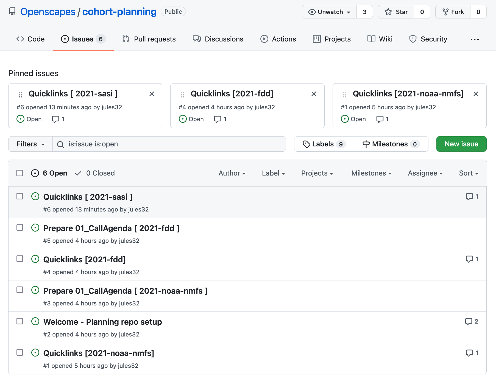
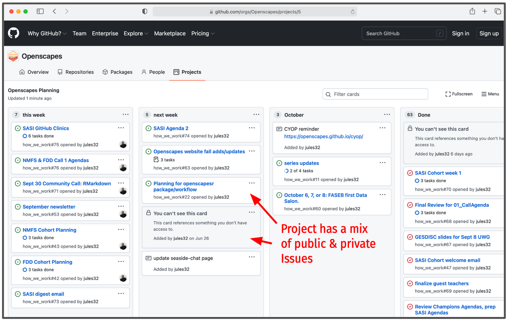

## Welcome to the team!

Through time, Openscapes has been onboarding folks for different roles and purposes. We are excited for more communities to be able to use the Openscapes approach!

A common way we start collaborating with folks is to to deliver the Champions Program, and this page was first built to document the onboarding process to contribute to a Champions Cohort. This focused on onboarding folks to collaborate in different capacities — i.e. as mentors, assistants, evaluators, lesson contributors, guest teachers — so we will be trying to be as streamlined as possible with the most relevant information and skill-building to meet specific needs and timeframes.

To support the growing Openscapes work, we are also onboarding core team members to support Mentors, build and maintain infrastructure, as well as leading Champions Cohorts and other events. Here are some of the ways we've approached this as well.

::: {.callout-note icon="false" collapse="true"}
## Onboarding Issue: NASA Openscapes Cloud Team Member

We'll soon be onboarding a new team member, whose primary focus is to support the NASA Openscapes Mentor community! From our job posting for this 1/2 time contracting position, we had 24 candidates apply. Working with @lizneeley of [Liminal](https://www.liminalcreations.com/), who is an expert in science communication, design, and sensemaking, we developed a hiring rubric and designed an interview process to create an equitable hiring and evaluation process that aligned with our open kinder science values, community, timeline, and that we can reuse and improve upon in the future. In February 2024 we led 2 rounds of interviews with really stellar candidates. We are so grateful for these candidates working in this space with very diverse skillsets and backgrounds who are interested in this position and being a part of this NASA Openscapes work and the open science community.

These are specifics about the role that we shared before the final round of interviews -

## Background: Openscapes Cloud Team Member

**Ethos:** The Openscapes Cloud Team Member position will be supporting NASA Openscapes Mentors and be part of the Openscapes Core Team. We expect this to be ¾ NASA and 1⁄4 Core. This isn’t merely a contract; the Openscapes team are leaders in the open science movement. Collaboration is essential to this job: you will not only complete tasks assigned to you, but you will lead and role-model how to support others in Cloud/open source software. To do that, you will need to identify and then support the needs of the NASA Mentors and the Openscapes broader community: building trust and being comfortable learning with others will be essential.

**Scheduling**: The contract is 6 months, with a high probability of an additional year. We meet synchronously with NASA Mentors weekly – we alternate between Wednesdays and Thursdays. We do our best to be responsive to Mentors’ needs, sometimes creating additional coworking times. Our Openscapes Core Team currently works half-time throughout the week, budgeting time around synchronous calls and focusing asynchronous time to advance work in collaboration with the Mentors and prioritized for those calls. We do our best to not have synchronous calls on Mondays and Fridays, and estimate a high end of 10 hours of synchronous calls per week. These calls will also serve to onboard you to how we work so you can learn and then contribute.

Your weekly synchronous responsibilities will include:

-   Openscapes Core Team meetings - (1.5 hrs/week - TBD, likely weekly Tues)
    -   Purpose: onboarding, sharing across the Openscapes Core Team. Timing will evolve as we go.
-   NASA Mentor Calls (1.5 hrs/alternating Weds 10-11:30 PT, start Mar 6)
    -   Purpose: get to know Mentors, how we work, listen for needs, contribute
-   NASA Mentor Coworking (1.5 hrs/alternating Thurs 10-11:30 PT, start Mar 14)
    -   Purpose: get to know Mentors, how we work, contribute.
    -   Focus: Cloud infrastructure & Cookbook hackdays

In addition, there are additional synchronous calls upcoming this spring:

-   NASA Champions launch (1.5-3 hrs/week for 3 weeks, Mar 19 10-11:30 PT; then Thurs 1-2:30 PT Mar 21 -Apr 4)
    -   Purpose: Setting up NASA Champions Cohort - starts Apr 3
-   earthaccess hackdays - (2 hrs/alternating Tues, 10-11:30 PT, start April 2)
    -   Purpose: support python library development, documentation
-   Workshop planning hackdays - (2 hrs/alternating weeks - start April, TBD)
    -   Purpose: support cross-workshop planning, automation, documentation

**Tasks:** These tasks were identified by the NASA Openscapes Mentors as priorities for 2024.

-   **earthaccess** - support this NASA Mentors-built and community-maintained python library. Involves supporting a welcoming open source contributing environment, facilitating/tech-hosting hackdays, applying package-development skills, supporting increased user adoption and community engagement while also promoting R and MATLAB complements
-   **Cloud infrastructure** - work with 2i2c team on Access Policies and implementation; support base image transportability and utility across Python, R, MATLAB, QGIS; support R Cloud efforts and incorporate into Cookbook. Opinionated R experience would be a benefit here.
-   **Cookbook** - support tutorial review and GitHub pull requests, add to documentation, opinionated Quarto formatting, GitHub Actions; workflows to reduce things living in many places
-   **Workshop planning** - support MainPlanning GitHub Project; support Mentors adding participants to 2i2c Hub for workshops; use & extend kyber R package for workshop structure automation and survey analysis

## Onboarding

Onboarding the Cloud Team Member will follow the way we have grown Openscapes teams so far: using our [Flywheel](https://openscapes.org/approach#openscapes-flywheel) ([Robinson & Lowndes 2022](https://eartharxiv.org/repository/view/4560/)). Our approach is "onboard and delegate" and not "train the trainers". The new team member will join existing calls with the Core team and NASA Openscapes Mentors, where they will first listen and learn, understanding the culture and needs first as they build trust and then offer advice and skills to support the Mentors. We'll be working closely with this person to help identify places to contribute and scoping priorities identified by the Mentors to support NASA Earthdata users. We'll all have a lot to learn from each other!

We have been documenting onboarding from previous turns of the flywheel, and these resources will help us and this new person get up to speed and contribute - including by helping improve the onboarding documentation.

{fig-alt="slide showing Documentation in 3 places for 3 audiences for onboarding: project website for nasa leadership, Cloud Cookbook for nasa mentors, Approach Guide for Openscapes team" fig-align="left" width="70%"}

We're really excited to welcome this person to the community and work together ❤
:::

The above was posted as "How we work" [issue #323](https://github.com/Openscapes/how_we_work/issues/323).

::: {.callout-note icon="false" collapse="true"}
## Onboarding: NASA Openscapes Suborbital Team Member

We'll soon be onboarding a new team member, whose primary
focus is to support the NASA Openscapes Mentors and Suborbital scientists as part of the Openscapes Core Team! From our job
posting for this half time contracting position, we had 36 candidates
apply. Reusing the approach developed by [\@LizNeeley](https://github.com/LizNeeley) of [Liminal](https://www.liminalcreations.com/),
who is an expert in science communication, design, and sensemaking, we
developed a hiring rubric and designed an interview process to create an
equitable hiring and evaluation process that aligned with our open
kinder science values, community, timeline, and that we can reuse and
improve upon in the future. In January we led 2 rounds of interviews
with really stellar candidates. We have also been delayed in receiving the funding and appreciated these candidates navigating shifting timelines with us. We are so grateful for these candidates working in this space with very diverse skillsets and backgrounds who are interested in this position and being a part of this NASA Openscapes work and the open science community.

These are specifics about the role that we shared before the final round of interviews, with some more details as our timeline has become more solid -

**Ethos:** The Openscapes Suborbital Team Member position will be supporting NASA Openscapes Mentors, Suborbital scientists and part of the Openscapes Core Team. This isn’t merely a contract; the Openscapes team are leaders in the open science movement. Collaboration is essential to this job: you will not only complete tasks assigned to you, but you will lead and role-model how to support others in Suborbital/open source software. To do that, you will need to identify and then support the needs of the NASA Mentors and the Openscapes broader community: building trust and being comfortable learning with others will be essential. 

**Scheduling:** The contract is 8.5 months, with possibility of extension depending on funding. We meet synchronously with NASA Mentors weekly – we alternate between Wednesdays and Thursdays. We do our best to be responsive to Mentor+scientists’ needs, sometimes creating additional coworking times. Our Openscapes Core Team currently works half-time throughout the week, budgeting time around synchronous calls and focusing asynchronous time to advance work in collaboration with the Mentors+scientists and prioritized for those calls. We do our best to not have synchronous calls on Mondays and Fridays, and estimate a high end of 10 hours of synchronous calls per week. These calls will also serve to onboard you to how we work so you can learn and then contribute and lead.

Your weekly synchronous responsibilities will include: 

-   **Openscapes Core Team meetings** - (1.5 hrs/week - currently Tuesdays 8:30-9:45am PT)

    -   Purpose: onboarding, sharing across the Openscapes Core Team.

-   **NASA Mentor Calls and/or Coworking** (1.5 hrs/alternating Wednesdays and Thursdays 10-11:30 PT)

    -   Purpose: get to know Mentors, how we work, contribute to the Cookbook structure and lessons

    -   Focus: Cookbook hackdays, focus on contributing and how to onboard new Mentors 

-   **Suborbital Coworking - to be scheduled, likely weekly, to support teams and to we design the plan and prepare for the Notebook Clinic**\

In addition, there are additional synchronous calls upcoming this spring:

-   **NASA Openscapes Champions Cohort** (1.5 hrs/week for 10 weeks, to be scheduled likely in Apr-Jun)

-   **Notebook Clinic for Suborbital teams** (1.5 hrs/week for 8-10 weeks, to be scheduled likely in the fall)

**Tasks**

The new team member will work closely with lead the Openscapes team to refine/evolve the following as needed. The new team member will onboard to Openscapes approaches with the team and be supported and get feedback as they take on more responsibility. \

1.  **Develop a suborbital science team community**. We will reuse and grow from what works from the last four years of building the NASA Openscapes Mentor community, and connecting to community momentum at NASA. This work involves:

    1.  Joining existing meetings, getting a sense of the group, giving talks, asking questions, sending followup messages, having open documentation of activities, scheduling 1:1 conversations. 

    2.  Hosting regular Coworking sessions; a light-weight way where they connect and help solve common challenges. This will build trust so they would prioritize time for the Clinic, as we design the Clinic to fit their needs. 

2.  **Lead a Notebook Clinic.** We will draw from what we’ve learned from leading 24 Champions Cohorts (Openscapes’ flagship program to help teams make real change around reproducible and transparent workflows). We teach as a team. Following this structure, the clinic would be 10 weeks, 1.5 hours each week, with alternating weeks being lesson-based and hands-on work based (https://openscapes.github.io/series). Our approach includes:

    1.  Focusing on developing relationships with potential participants (above) as well as developing the Clinic itself. The Clinic will build on the rhythm from Coworking and be a friendly place to learn. We will invite suborbital teams to join via a short nomination form, both which Openscapes has found to increase buy-in and decrease attrition. 

    2.  Size of cohort will be 40 people max; we have found this is best for learning, since it enables active engagement and any bigger starts feeling like a webinar. 

    3.  Developing lessons to focus on building reusable workflows with Jupyter Notebooks, Quarto, and GitHub, using the earthaccess python library, and writing documentation that focuses on onboarding. We will develop documentation, tutorials, and templates the teams can reuse.

    4.  We will teach with an open facilitation approach, drawing on our experience as Carpentries certified instructors, using agenda as live shared note taking, and having multiple channels for asking help, including asynchronous chat and synchronous having breakout rooms.

    5.  ​​Notebook Clinic lessons will be added to the Earthdata Cloud Cookbook for discoverability and reuse.

3.  **Amplify suborbital science teams**. We willcreate opportunities to share work, both through talks and through a mechanism for adding contributions to the Earthdata Cloud Cookbook. This involves: 

-   Giving talks to different groups, particularly with NASA staff, NASA Openscapes network of open source communities, industry, academia, other government agencies. 

-   Connect suborbital teams to Openscapes’ network of engineers, teachers, managers, scientists, facilitators, we can help people get the help they need, and help their work get in front of people who need to hear about it. 

-   Improving documentation and onboarding for suborbital teams (and anyone) to contribute workflows to the NASA Earthdata Cookbook. 

**Core team contributions** - we use the same tech and approaches in NASA and Openscapes core work, and thus work to improve systems and teach each other in both settings. Examples include refining project management, adding to documentation, improving GitHub Action/Quarto workflows, writing blog posts, reviewing other people’s work and giving feedback, participating in teaching/mentoring/coaching activities to build our skills.

## Onboarding

Onboarding the Cloud Team Member will follow the way we have grown Openscapes teams so far: using our [Flywheel](https://openscapes.org/approach#openscapes-flywheel) ([Robinson & Lowndes 2022](https://eartharxiv.org/repository/view/4560/)). Our approach is "onboard and delegate" and not "train the trainers". The new team member will join existing calls with the Core team and NASA Openscapes Mentors, where they will first listen and learn, understanding the culture and needs first as they build trust and then offer advice and skills to support the Mentors. We'll be working closely with this person to help identify places to contribute and scoping priorities identified by the Mentors to support NASA Earthdata users. We'll all have a lot to learn from each other!

We have been documenting onboarding from previous turns of the flywheel, and these resources will help us and this new person get up to speed and contribute - including by helping improve the onboarding documentation.

{fig-alt="slide showing Documentation in 3 places for 3 audiences for onboarding: project website for nasa leadership, Cloud Cookbook for nasa mentors, Approach Guide for Openscapes team" fig-align="left" width="70%"}

For the Suborbital position, it will also be important to review:

-   [GitHub-Quarto contributing clinic](https://docs.google.com/document/d/1A3hW2leoreaabsmkgvR45UxlWwOE7KksdzfU2vkxb-s/edit?tab=t.0)

-   Suborbital tutorials including <https://nasa.github.io/VITALS/python/Finding_Coincident_Airborne_and_Orbital_Data.html>

We're really excited to welcome this person to the community and work together ❤
:::

## First Introductions 

To first get a sense of Openscapes, we recommend looking through [openscapes.org](https://openscapes.org), including the [Approach](https://openscapes.org/approach) page and the [Champions](https://openscapes.github.io/series/program-summary) program summary.

## Experience a Cohort Call

The next step is to experience the Cohort Calls to see what they are really like. Hopefully this can happen live, but if not we'll give you access to an example folder of [Openscapes_CohortCalls](https://drive.google.com/drive/folders/1JaQ3Dkrr7pUfesSaxqRqntGlxG0dz2nl?usp=sharing). The folder has four 1.5-hour videos and associated agendas, as well as the drafted blog post. We suggest you:

-   Read the blog post to get an overview
-   Watch a `CallRecording` while at the same time reading through the accompanying `CallAgenda` (we'll let you know which one we recommend). We use the Agendas for live note-taking but don’t screenshare it; you’ll hear us orient you to page numbers and sections as we go
-   Go through a few examples in the `PathwaysShare` folder to get a sense of what Champions share on the last call

## Seaside Chats / coworking

We'll then meet for a Seaside Chat to get oriented and establish a workplan. We expect this to look like the following for different collaborators. These are outlines of a few first few meetings.

### Cohort Mentors/Assistants

1.  **Getting oriented**: discuss Cohort Calls, pre-Cohort engagement & setup, tooling
    -   cohort dates/calendar
    -   add to Slack
2.  **GitHub Clinic**: using GitHub to collaborate and publish from the web
3.  **RMarkdown/Quarto Clinic**: how to contribute to the approach-guide and events site
4.  **Coworking**: from here, we'll likely co-work to develop event pages, Call Agendas and Digests, and use GitHub Issues/Projects

### Lesson Contributors

1.  **Getting oriented**: discuss Cohort Calls, [lesson series](/champions/lessons.html), brainstorm lesson plan
    -   cohort dates/calendar
    -   add to Slack
2.  **Lesson workplan**: solidify lesson plan, establish workplan/coworking
    -   Example: [SASI Cohort Lesson Plan](https://docs.google.com/spreadsheets/d/1nYS_EDhddmG3ILwqmO432tUsjjshlhHnxuoSM4r2cs4/edit#gid=0)
3.  **Coworking**: from here, we'll likely co-work to develop Call Agendas and use GitHub Issues/Projects

## Cohort Planning using GitHub Issues

As we get further along with planning the Cohort, we'll be using GitHub Issues to coordinate together. Depending on the Cohort, we'll use the [cohort-planning](https://github.com/openscapes/cohort-planning) repo, or potentially the Cohort repo itself. We often pin "quicklinks" so that we can easily navigate to the docs we need when we need them when leading Cohort Calls!

{fig-align="center" width="80%"}

The [cohort-planning](https://github.com/openscapes/cohort-planning) repository is one of the repositories included in the Openscapes Organizational-level Projects board that helps us organize our "todo" items. We are getting into the rhythm of using Project Boards and can set up additional ones too.

