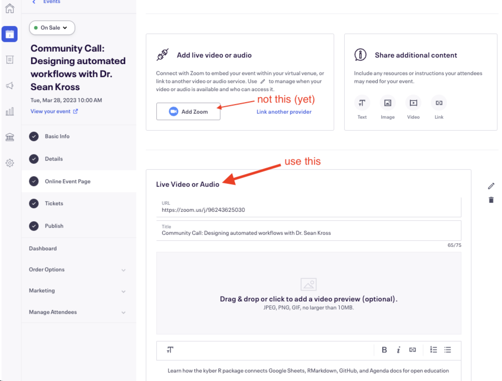
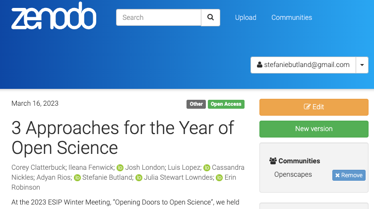
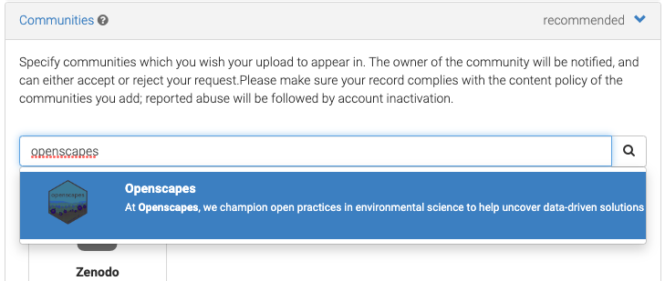
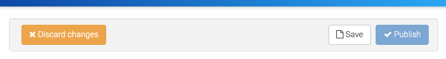
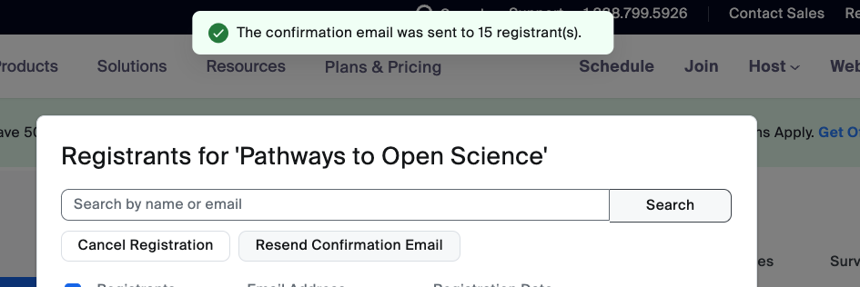

We try to use a few tools that interoperate well and are open source and collaborative.

We also explore and learn new tools but always always with an eye towards interoperability with our current tooling, and with an understanding of how the open science community and environmental/Earth science communities are working.

Below are the tools that we use, why we use them, and set up instructions. (Here are some [Macbook setup notes](https://github.com/Openscapes/teaching-learning-resources/issues/12)).

::: {.callout-note collapse="true"}
## Eventbrite registration deprecated in favor of Zoom

We use Eventbrite to manage registrations for events like the Pathways to Open Science series, and Community Calls. We plan to explore Zoom registration to see if it's a good alternative for our needs.

For [Pathways to Open Science](https://openscapes.github.io/pathways-to-open-science/), we created a **"series" of 6 events** instead of individual events. Challenge was that every event will list the same duration, while reality was they alternated weekly with 1.5hrs for community call and 1hr for coworking.

### Eventbrite - Zoom - Google Cal how-to set up an event

Recommended workflow for now:

1.  Create Google Cal invite \> make it a Zoom meeting from inside that invite (if your Google Cal is integrated with Zoom ) \> save. That meeting will appear in your Zoom account. Confirm it has waiting room and no password.

2.  In Eventbrite, create Event \> copy Zoom link into Eventbrite \> Event \> Online Event Page \> Live video or audio, instead of "Add Zoom"

    -   *What didn't work well*: "Add Zoom" button, which used "Stefanie Butland's personal meeting room", created a mtg in Zoom that has a Zoom registration link, not a clear meeting link. Stumped for now as to how to make that Eventbrite-Zoom integration work.

    {width="500"}

3.  Create and schedule reminder emails.Eventbrite \> Manage attendees \> Emails to attendees \> create one custom reminder email. Set reply-to as `hello@openscapes.org`. Delete other default reminders (Eventbrite makes 3 reminders by default and that's annoying). For reminder emails in an event series, we must update for every event in the series.

    -   We create a custom reminder email with *Subject*: Zoom link for Openscapes event-name. *Body*: We're excited to see you later today! At the session start time (5:00 - 6:00 pm ET), please click to join us in Zoom: LINK. Optional, include event logo or Openscapes logo.

    -   *Why a custom email reminder?* Several community call participants said it was hard to find the zoom link with Eventbrite's default reminder email (Stef agrees); that's why we put "Zoom" in subject line of custom reminder.
:::

## GitHub

-   documentation, like this Approach Guide
-   version control for everything that's not Google Drive
-   coordination with Issues and GitHub Projects
-   publishing all our R-based web communications
-   comms through website

## Google Workspace

We use an Openscapes Google Workspace. This is our default system for Champions Cohorts, however, we have adapted when required to use MS Teams / Sharepoint.

-   Calendar
-   Drive
-   Docs
-   Sheets
-   Slides

### Zoom over Google Meet

We prefer to use Zoom over Google Meet, which has some limits to functionality e.g. breakout rooms. In Zoom, participants are able to move freely in and out of breakout rooms, if that setting is selected when creating breakouts. In Google Meet, the host must assign people to breakouts either before the meeting via the Google Calendar invite, or during the meeting. If you invite a Google group to a meeting, participants in that group won't automatically be available to distribute into breakout rooms.

Google documentation: [Use breakout rooms in Google Meet](https://support.google.com/meet/answer/13054147?co=GOOGLE_MEET._MeetingUserType%3DHost&oco=0).

### Google Groups

We use **Google Groups when possible** to easily email groups of people and / or add them to Google Folders and Calendars invites. Examples: Openscapes Newsletter email to subscribers, Mentors, NMFS Openscapes Data Academy participants. Google Groups work well for people and organizations that use Google products, and not so well for those who use Microsoft products. Not everyone can use their work email or computer to access Google products.

**We send emails via Google Group** following this procedure documented by [Stanford IT](https://uit.stanford.edu/service/gsuite/groups/mailinglists/list-faqs):

> Compose your email message. In the "To" field of an email message, instead of adding each team member's email address to your email, just enter the group's address as a recipient.

**Documentation for different applications:**

-   [Openscapes Newsletter](https://openscapes.github.io/approach-guide/approach/newsletter.qmd)
-   [Mentors tech setup](https://openscapes.github.io/approach-guide/mentors-framework/tech-setup.qmd)

**Manual additions to a Google Group are limited to 100 emails per organization in a 24 hr period**, i.e. not per workspace manager.

To add more emails at once, such as when we add a large list of newsletter subscribers, the admin can do a bulk upload with a csv file. [Google Support how-to](https://support.google.com/a/answer/9400087?hl=en&sjid=7940896354587010253-NC&authuser=1#upload&zippy=%2Cupload-users-from-a-csv-file).

CSV Format:

-   Header: Group Email \[Required\],Member Email,Member Type,Member Role

-   Entry: [yourgroup\@email.com](mailto:yourgroup@email.com), [membername\@email.com](mailto:membername@email.com),USER,MEMBER

## Mastodon / Bluesky / Twitter

Social media, and specifically Twitter, has been a huge part of growing the Open science community. We've taught and written about Twitter a lot in the past.

Mastodon is a social network platform that is free and open-source. It's been around for quite a while, but many folks migrated there from Twitter. Twitter has tweets; Mastodon has toots. Many open science orgs and communities like The Carpentries and Openscapes are there. For context, some of them posted about their plans/ reasons for moving away from Twitter and toward Mastodon: [The Carpentries](https://carpentries.org/blog/2022/11/community-statement-twitter/), [rOpenSci](https://ropensci.org/blog/2022/11/16/mastodon-en/).

Here is a [Mastodon Quick Start Guide](https://zenodo.org/records/10019853) by Yanina Bellini Saibene, Oscar Masinyana, Alycia Crall. rOpenSci posted about: [Scheduling Mastodon Posts in R with rtoot and GitHub Actions](https://ropensci.org/blog/2023/05/17/scheduling-mastodon/). 

Openscapes has stopped posting to Twitter and now posts to our Mastodon and Bluesky accounts. There are concerns around inclusion about Mastodon and Bluesky as well, and it remains to be seen which social platform will evolve into the place for thriving, safe, inclusive science conversations. 

## ORCID/Rescognito

We encourage people to create and populate their [ORCID](https://orcid.org/) (Open Researcher and Contributor ID) profile.

> ORCID provides a persistent digital identifier (an ORCID iD) that you own and control, and that distinguishes you from every other researcher. You can connect your iD with your professional information --- affiliations, grants, publications, peer review, and more. You can use your iD to share your information with other systems, ensuring you get recognition for all your contributions.

## Quicktime video editing

Sometimes we want to edit a Cohort Call recording to **remove a section from the middle** and keep the start and end segments, e.g. Main room chat during breakouts.

This video says it all: [Trimming Clips or Cutting Parts Out of the Middle Using Quicktime](https://youtu.be/82CiWXI4rlQ) (2min 40sec). Briefly:

-   make copy of your video to edit
-   go to start point of section you want to remove
-   use arrow keys for finer navigation
-   Edit \> Split clip \> Done
-   go to end point of section you want to remove
-   Edit \> Split clip \> Done
-   View \> Clips and delete the relevant clip
-   Save

Once you delete a section \> Done, the clips are automatically spliced together.

Sometimes we want to edit a recording to **remove the start and/or the end**.

Using Edit \> Trim, it can be hard to control how fast the yellow Trim brackets move. Let's say we want to trim (delete) everything after time 59 mins.

-   Go to the 59 min point in the video first
-   click Edit \> Trim ... Yellow brackets appear around the whole video, with a red vertical line - the 'playhead' - at 59 mins. The yellow-bracket segment is the part that will be kept
-   Type "i" to move the starting point to the playhead's position (keep the end of the video), or type "o" to make the ending point at the playhead's position (keep the beginning of the video).
-   Click Trim
-   Save

## ROR - Research Organization Registry

Openscapes was assigned ROR ID [ror.org/022je8241](https://ror.org/022je8241) in ROR release v1.67.

[ROR](https://ror.org/) is a global, community-led registry of open persistent identifiers for research organizations.

## R/RStudio

-   all websites and books
-   data analysis (R: tidyverse, RMarkdown)
-   communications and technical writing (RMarkdown, bookdown, blogdown, Quarto)
-   [RStudio and GitHub setup instructions](https://openscapes.github.io/series/how-to/setup-rstudio-github.html)

## Screen recording

Thanks to Emma Ganley and Sam Csik for versions of this tip.

To make a screen recording without audio, on a Mac, Ctrl-Shift brings up screen recording controls. We need to figure out how to set which screen to record during dual screen use.

To make a screen recording without audio, on a Mac, using Quicktime. File \> New screen recording \> select options for what to share \> to end recording, click Stop icon (black box at top of your screen). We can use the video editing instructions (under Quicktime above) to trim any rough start.

Want to turn your video into a gif to have your screen recording play automatically (instead of having to press play on an embedded video) in a blog post or documentation? Upload your video to https://ezgif.com/video-to-gif/, select the frame rate that most closely matches the length of your video, in seconds.

## Slack

### Welcome to Openscapes Slack 🤗! 

*Have you received an invitation to join Openscapes Slack? Here's some information to help you get comfortable.*

**About:** This is a diverse open science community. We use Slack as a way for people to connect with each other. We want it to be a supportive, trust-based community of folks doing data intensive science. Members include, but are not limited to, people who have participated in a Champions Program, NASA or NOAA Fisheries Openscapes Frameworks, Pathways to Open Science, Reflections, earthaccess contributors, NASA Cloud Cookbook Hackdays, or other Openscapes programs, and their collaborators. Current Slack members can invite others to join - an informal sponsorship approach. These are reviewed and approved by an Openscapes core team member.

**How do I use it?** Slack can feel like a daunting new tool, especially when we're introducing lots of new tools during Champions Cohorts. There are both technical and etiquette aspects to getting comfortable. For technical tips see [Getting started for new members](https://slack.com/intl/en-ca/help/articles/218080037-Getting-started-for-new-members) and [How to use Slack](https://slack.com/help/articles/360059928654-How-to-use-Slack--your-quick-start-guide). This Slack [quick start guide](https://doi.org/10.5281/zenodo.3763729) (@woodley2020) from the Center for Scientific Collaboration and Community Engagement includes 1) configuring your account; 2) channels and notifications; 3) communicating.

**When you join**, you'll automatically land in several channels: #welcome, #cool-finds, #events, #general, #random, #shared-joy 🌈. You can browse other channels, like #jobs-funding and choose to join them. People are invariably friendly and open to asking and answering questions. You can get a feel for how things work by "listening" to the discussions, then jump in!

The **#welcome channel** is a place for new members to introduce themselves and for the rest of us to help them feel welcome by adding an emoji or saying "I work on sea turtles too!". Here's a short read on [The Value of #Welcome](https://ropensci.org/blog/2017/07/18/value-of-welcome/).

If you're part of a cohort for an Openscapes program you may be invited to a private cohort channel. Open isn't all or nothing; being open with the peers you're getting to know is a good way to start getting comfortable with the Slack community more broadly.

Openscapes uses the free Slack plan. This means we can all see message history for the previous 90 days. We do this partly to encourage good open documentation practices: if you are discussing workflow or software development, decisions should be put in (open) documentation and not in Slack. 

### Channel purposes

These definitions are meant to help people know where to post or ask questions. They are listed in the Slack channel Topic and Description (because the Topic preview is easily visible in the channel, while the Description, not so much).

**#welcome**: A place for people new to our community to introduce themselves and for the rest of us to make them feel welcome; the default channel that members cannot leave if they leave all other channels.

**#general**: A place to discuss ongoing progress, friendly Q & A about good enough practices, team culture, tools. Announcements from the Openscapes team and others.

<!-- **#seaside-chats**: A place to discuss ongoing progress. Friendly Q & A about good enough practices, team culture, tools ... -->

**#events**: Events that might be of interest to others in our community. Openscapes events also go in #general.

**#cool-finds**: Posts, datasets, podcasts, repos, papers, videos, packages, ...things you found that are cool.

**#jobs-funding**: Job opportunities, seeking work, offers to connect people with those "on the inside".

**#shared-joy**: Sharing joy of any shape or size.

**#random**: Hallway conversations.

**team-openscapes**: (private) \~daily checkins. We started this when our team grew in 2024 so that Stef and I weren’t in DMs anymore. Like we did during [mentor-coaching](https://openscapes.org/blog/2023-05-17-mentor-coach/index.html), we check in here daily when we’re working on Openscapes stuff to say hi and give a heads up about what we’re working on. For Stef, Andy, and me this is almost daily, for Liz and Ileana, it’s less so and when it’s makes sense for them, since they're less time. We tag people when they’re needed directly so if it’s better for you to not be notified until you’re tagged that is great too.

### Invite someone to Openscapes Slack

Inviting someone to join Openscapes Slack? In an email or other communication, send them the link to [Welcome to Openscapes Slack 🤗!] and a link to join.

To create a link to join Slack, in the app, `Invite people to join Openscapes` , choose 🔗`Copy invite link`. 99% of the time, we do not invite someone by adding their email to invite from inside the Slack app. Why? With the free plan, we are not able to send a custom invitation note from inside Slack, and with our paid plan we were not able to add a URL to a custom note to provide our welcome info.

The channels people join by default are set in the browser admin interface [Settings & Permissions](https://openscapes.slack.com/admin/settings) \> Default Channels. Currently #welcome, #cool-finds, #events, #general, #random, #shared-joy.

### Set Slack reminders

Here's an example of how to set a Slackbot reminder for recurring meetings, in this case, biweekly. Add links to "zoom link" and "notes".\
`/remind #earthaccess “Our earthaccess hack starts in 1 hour! Here is the meeting zoom link and the notes” at 9AM every other Tuesday`

Here's how it appears in Slack:\
"Reminder: Our earthaccess hack starts in 1 hour! Here is the meeting zoom link and the notes"

### Slack integration with GitHub

We haven't implemented this, but the how-to is here.

We'd love for most resource sharing and conversations to happen in the open and in a more persistent location than Slack. Places like GitHub Discussions are great for this. Thanks to [Matt Fisher](https://github.com/MattF-NSIDC) for getting us started with Slack notifications for GitHub Discussions.

We can subscribe Slack channels by repository and event types we're interested in. In Slack, we can run `/github help` to get some more info on the command to modify subscriptions. [Full documentation](https://github.com/integrations/slack/blob/master/README.md).

#### Example

The Slack `#nasa-mentors` channel is set to get notified of new and answered [discussions](https://github.com/NASA-Openscapes/earthdata-cloud-cookbook/discussions) for just the [Earthdata Cloud Cookbook GitHub repo](https://github.com/NASA-Openscapes/earthdata-cloud-cookbook). The subscription process was started with this command:

```         
/github subscribe NASA-Openscapes/earthdata-cloud-cookbook discussions
```

The above will subscribe to "discussions" in addition to undesirable [default notifications](https://github.com/integrations/slack/blob/master/README.md#customize-your-notifications). We can unsubscribe from the defaults to quiet it down with another comment:

```         
/github unsubscribe NASA-Openscapes/earthdata-cloud-cookbook issues pulls commits releases deployments
```

## Zenodo {#sec-zenodo}

We cover a lot here. See the subheadings in the navigation bar to the right to jump to a section:

-   Zenodo Openscapes Community creation and curation
-   How to add your existing Zenodo record to the Zenodo Openscapes Community
-   How to publish a new record in Zenodo to get a DOI
-   How to get a DOI for materials on GitHub

We want to share our material in a way that other people can find it, use it, improve it, and cite it. For our lesson materials, like Champions Cohorts, this provides a robust way for people to add their participation to their CV as professional development. We use the Zenodo repository and a [Zenodo Openscapes Community](https://zenodo.org/communities/openscapes/) for this purpose.

[Zenodo](https://zenodo.org/) is a general-purpose open repository that allows researchers to deposit research papers, data sets, research software, reports, and any other research related digital artefacts. For each submission, a persistent [digital object identifier](https://en.wikipedia.org/wiki/Digital_object_identifier "Digital object identifier") (DOI) is minted, which makes the stored items easily citable (adapted from [Wikipedia](https://en.wikipedia.org/wiki/Zenodo)). Zenodo allows for versioning and we can preserve GitHub repositories in Zenodo. GitHub itself is *not* a repository. For the full picture, this 1-hr webinar is helpful: [Zenodo: open digital repository \| 2022.12.07](https://youtu.be/yj2r8RayIX8).

We created a [Zenodo Openscapes Community](https://zenodo.org/communities/openscapes/) as a "semantically meaningful group" of research products using these example Zenodo Communities as inspiration: NASA's [Transform to Open Science](https://zenodo.org/communities/tops/); [Center for Scientific Collaboration and Community Engagement (CSCCE)](https://zenodo.org/communities/cscce/).

Zenodo has a Sandbox in which one can create and refine a draft Community before creating the real thing. This webinar section "[How to create a community](https://youtu.be/yj2r8RayIX8?t=734)" screenshares a walk-through that makes things crystal clear. Creating a Sandbox first forces you to recognize decisions to make before creating the real thing, like: needing to create it from an account that looks professional like "curator", rather than a personal email username; or deciding what types of research products to include.

### What do we curate in our Zenodo Openscapes Community?

Anyone can request to have their Zenodo record listed in the Zenodo Openscapes Community. Curator is Stefanie Butland via curator\@openscapes.org. We don't want to include *everything*; too big and its value diminishes. We do curate:

-   Resources on GitHub like the Openscapes Champions Lesson Series, NASA Earthdata Cloud Cookbook, Pathways to Open Science
    -   make a "release" on GitHub and submit that to Zenodo, choose type = other, or lesson. See instructions in [Documentation](https://openscapes.github.idocumentation.qmd#make-our-documentation-citable).
-   key blog posts like ESIP 2022, 2023 panels
    -   create and upload pdf of post from the website, choose type = other
-   slide decks from key presentations
    -   upload pdf of slides, choose type = presentation

We do not curate datasets.

### How to add your existing Zenodo record to the Zenodo Openscapes Community

If you own an **existing** Zenodo record you'd like to have listed, log into Zenodo, go to that record's page, click yellow Edit button (top right) ...

{fig-alt="screenshot of zenodo record page where owner is logged in, showing yellow Edit button" width="460"}

In the Edit page that appears, scroll to Communities section \> type "openscapes" and select it ...

{width="460"}

Click Save \> click Publish (these appear at top and bottom of the edit page)

{width="460"}

curator\@openscapes.org will get email notification of your request and accept, or may ask for further information.

### How to publish a new record in Zenodo to get a DOI

[Video tutorial](https://youtu.be/BPVSErzNtME) from OpenAIRE_eu (4.5 min)

1.  For a blog post or presentation, save as pdf, filename: openscapes_post_name_year.pdf or slides_name_year.pdf, example: openscapes_post_noaa_afsc_2022.pdf

2.  Login to Zenodo (login via GitHub is convenient), go to <https://zenodo.org/deposit/new?c=openscapes> and upload your pdf (files \> start upload). Using that link automatically includes your record in our community collection.

3.  Upload type

    -   blog post: Other
    -   slide deck: Presentation

4.  Basic information

    -   Digital Object Identifier: leave blank
    -   Publication date: date of blog post publication, or presentation
    -   Title: title of post or presentation without adding version number
    -   **Authors / creators**:
        -   We can take advantage of back-end system links between Zenodo, [ROR](https://ror.org/) (Research Organization Registry), and [ORCID](https://orcid.org/) to auto-complete names, ORCID IDs, and affiliations that will automatically appear in Zenodo records. Openscapes was assigned ROR ID [ror.org/022je8241](https://ror.org/022je8241) in ROR release v1.67.
        -   Start typing the author's name and select from a list of auto-complete options. If none is available, use author name consistent with other Zenodo records in their name; manually add their ORCID ID.
        -   Author's **affiliation**: Start typing the affiliation name. For Openscapes and other orgs registered with ROR, you will see a dropdown list that includes one annotated as `Source: ROR (preferred)`. Select that one to autocomplete. This will result in a ROR logo and link to Openscapes ROR record being linked in their affiliation (click 'show affiliations' in this [example](https://zenodo.org/records/14428503)).
        -   We keep a list of Openscapes authors ORCID IDs in `OpenscapesParticipantsMainList` Google sheet, Mentors tab
        -   If the person has granted ORCID permission to auto-update from Zenodo, this new record will automatically appear in their ORCID profile. This is a pretty great bonus.
    -   Description: for an Openscapes blog post, use the italicized preface; for a presentation, use the abstract. End with "**Link to source blog post:** URL"
    -   Version (optional): We've settled on using [CalVer](https://calver.org/): YYYY.0M (zero-padded month) since Luis López said "I like CalVer for books and environments" when we asked for advice. It's a bit redundant with publication date.
    -   **Keywords**: To promote findability and consistency, we suggest using some of these keywords, based on those used by related records. Wow, keywords appear to be case sensitive. Search keywords:"Open Science" gives 1770 records; keywords:"open science" gives 1395 records; keywords:"open science" OR "Open Science" gives 11112 results (not sure why those don't add up) (May 23, 2023)
        -   Openscapes
        -   Open Science
        -   NASA
        -   NOAA
        -   JupyterHub
        -   cloud computing
        -   conference name e.g. ESIP, AGU, SORTEE, FORCE11
        -   Open Educational Resources (for lesson series)

5.  License: Open Access, Creative Commons Attribution 4.0 International

    -   For GitHub releases that include code and documentation, we include a LICENSE.md file on GitHub, then on Zenodo we select Licence: Other (Attribution).

6.  Funding: Would be great to add this, but we've not established guidelines yet

7.  **Publish!** At very top or very bottom, right side of the page, click Save \> Publish \> I understand. Voila! Your Zenodo record is live.

    -   The Zenodo Openscapes Community curator will be notified via email to approve inclusion of your record in the community.
    -   You can edit things like keywords and the Cite as text without affecting the DOI. To make a change to the file(s) itself, you must upload a new version which will give a new DOI.

### How to get a DOI for materials on GitHub

See [**Make our documentation citable**](documentation.qmd#make-our-documentation-citable)

### How to cite Openscapes publications

See "Cite as" in the publication's Zenodo record, in the right-side navigation bar.

## Zoom

We use Zoom as our primary meeting tool and for registrations for events that will be held via Zoom, such as Community Calls and the Pathways to Open Science series. Below are instructions for event registration, and for sharing audio in a Zoom meeting.

### Event registration

We can set up registration for a single event like a Community Call, or for a series like Pathways to Open Science.

-   Create a meeting. Check ✔️ 'Recurring meeting' for a series.
-   Check Registration ✔️ Required \> ✔️ Attendees register once and can attend any of the occurrences
-   Options \> Show \> Alternative Hosts: add someone else who has Openscapes Zoom license
-   Save
-   The 'Registration Link' is the URL we add to an event page.
-   See Registration tab; defaults are ok
-   Click Branding tab \> Logo: upload Openscapes hex; Banner: use a [banner image](https://github.com/Openscapes/website-new/tree/main/images/banner_imgs) from the Openscapes website
-   Click Email Settings tab \> Edit Confirmation Email to Registrants; use 'Send me a preview email' to check and iterate on the content

::: callout-note
Each person who registers receives a unique URL for the Zoom meeting. Do not share that link, since every person using it will be signed in with one person's name (ask us how we know ;-) ). The root of that link is the generic url anyone can use to join e.g. a speaker who did not have to register, or to post last minute in Slack for a Community Call.
:::

### View registrations and participants for an event

**View a list of registrants**. No option to export the list here.

-   Meetings \> select a meeting (click title/date, not Edit)

-   Registration tab \> Manage Registrants \> click View

**Export a csv file of registrants**

*This one is not intuitive. H/T Emily Anderson of Coiled.*

-   ADMIN \> Account Management (near bottom of left nav bar) \> Reports \> Meeting

-   Enter date of event, Select Registration Report \> ✔️ Check event \> Click Generate

-   Click Download

**Export a csv file of participants**

*Also not intuitive* ... because there are 2 sections called 'Reports' : one under ADMIN we use for registrants, and this one under PERSONAL for meeting participants

-   PERSONAL \> Reports \> Usage Reports \> Usage

-   Search narrow date range for event \> scroll to right to see Participants \> click number of participants shown \> Export with 'Show unique users' and 'Export with meeting data' selected

### Resend confirmation emails to registrants

Imagine people have registered and received their confirmation email with their unique Zoom link weeks in advance of your event. When it's time to join, how do they find the link?

This must be done semi-manually. In Zoom web portal \> Meetings \> your meeting \> Registration \> Manage Registrants \> View \> select Registrants checkbox to select all registrants on that page \> Resend Confirmation Email button. Repeat for each page of registrants. (See also [Zoom Support article](https://support.zoom.com/hc/en/article?id=zm_kb&sysparm_article=KB0068036); this pointed me in the right direction but said we had to send every single email separately.)

{width="67%"}

### Sharing audio in Zoom: Two scenarios

This Zoom resource covers two scenarios we use: [Sharing computer sound in a screen share](https://support.zoom.us/hc/en-us/articles/201362643-Sharing-computer-sound-in-a-screen-share). Screenshots below. Practice both beforehand, testing by recording yourself, because they're not obvious and chances of working smoothly on the fly in a meeting are ...low.

**Scenario 1**. During start of meeting, sharing welcome slides in a loop, with music from spotify playing so audience can hear, and people speaking does not disrupt music. See [**How to share audio with shared visuals**](https://support.zoom.us/hc/en-us/articles/201362643-Sharing-computer-sound-in-a-screen-share#h_01GBXFBZ8GBD3Z3YV70YRETA7Y).

{width="340"}

**Scenario 2**. During interludes where people are silent journaling, to share audio only, not screen. See [**How to play audio or music without sharing your screen**](https://support.zoom.us/hc/en-us/articles/201362643-Sharing-computer-sound-in-a-screen-share#h_01GBXFC4HB7B83C4T81Y5RRR38).

{width="340"}

IMPT: volume of shared sound is controlled in the source application. If spotify music is too loud, control volume in spotify (not your computer). See [**How to control the volume of a shared sound while in a meeting**](https://support.zoom.us/hc/en-us/articles/201362643-Sharing-computer-sound-in-a-screen-share#h_01GYDPMCB8E21X9YW0DQHKN0DV)

## Zotero

-   <https://www.zotero.org/>
-   Login from browser
-   Download desktop app and Zotero Connector to Firefox or your preferred browser
-   Quarto uses Zotero locally from the app, not from the web. Login to sync from our Openscapes Zotero library on the cloud, and then Quarto should be able to find them. There is a button in Zotero app to sync to a connected cloud library, if it does not happen automatically.

In our Openscapes group library, we have resources not limited to academic articles, but also youtube videos, blogs, teaching resources, and more.

## Code snippets

Snippets of useful code for things like managing lists of participants in our Google sheets

::: {.callout collapse="true"}
## Batch remove emails from participants list that failed/bounced

``` r
library(googlesheets4)
library(dplyr)
library(clipr)

gs4_auth(email = "your-email")

ss <- "url-to-your-spreadsheet"

# Read the email address column and pull it as a vector
champ_emails <- read_sheet(
  ss,
  sheet = "Champions",
  range = "D:D"
) |>
  pull(email)

# Read the email address column of failed emails and pull it as a vector
failed_emails <- read_sheet(
  ss = ss,
  sheet = "Failed_emails",
  range = "C:C"
) |>
  pull("email-failed")

# Replace missing emails with an empty string. Use empty string instead of NA
# otherwise they will be replaced with literal "NA" when copied to the clipboard.
champ_emails[champ_emails %in% failed_emails] <- ""
champ_emails[is.na(champ_emails)] <- ""

## Copy emails to the clipboard and paste into the email column
## in the Champions sheet
write_clip(champ_emails)
```
:::
