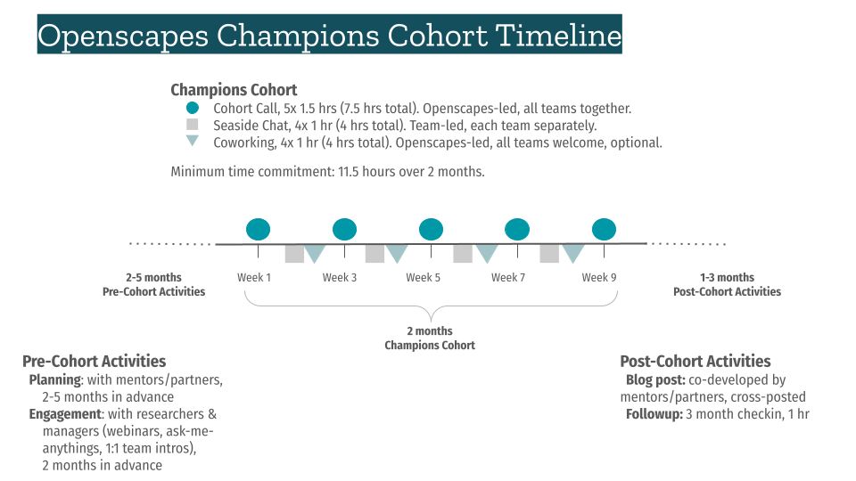

## Champions Program Design

The Champions Program is described at <https://openscapes.org> and is taught with the [Champions Lesson Series](https://openscapes.github.io/series/), which are open educational resources.

[{fig.alt="Openscapes Champions program slide shows" fig-align="center" width="90%"}](https://docs.google.com/presentation/d/1HGw4P095-lblHiGQHXYidHiVysjrPxuojxTxKtE13vk/edit)

Here are a few example presentations to introduce the Champions program with different audiences, including sharing with leadership and to recruit participants:

-   [Openscapes_ChampionsIntro2022](https://docs.google.com/presentation/d/1yCzG8cdFsTxmFyZijiUGi2hlyuJVM_i-imkTrao_O1g/edit#slide=id.gb1d0505bec_0_0)
-   [NMFS_Openscapes_2022_04_18](https://docs.google.com/presentation/d/1VAzYflkUTMVBS0onDThhVXxvja3z-nRGPwRuVsNKFks/edit#slide=id.g1138e626848_0_861)
-   [NWFSC_Openscapes_2022_02_14](https://docs.google.com/presentation/d/1qyW3KcwxiKwBffjsJ-fMF0snG99ahqZAnfq2xDSRPdc/edit?usp=sharing)
-   [Openscapes_Intro_AFSC_2021_12_02](https://docs.google.com/presentation/d/1QrHzdaHmcSKoBGsY12Gg5LaZhW1sfWz2TNLCh8DaJJI/edit#slide=id.gcfa9a8ce7e_0_246)

## High-level timeline

We work with our Partners to plan Champions Cohorts.

This includes coordinating within the partner community, scheduling dates, and preparing the engagement strategy to share the opportunity and attract research teams interested in better practices for their research.

1.  [**Cohort Planning**](/champions/cohort-planning.md) with partners: 2-5 months prior to Cohort start date.
2.  [**Pre-Cohort Engagement**](/champions/pre-cohort-engage.qmd) with potential participants: \~2 months prior to Cohort start date.
3.  [**Leading Cohort Calls**](/champions/leading-cohort-calls.qmd) for participants: 2 months.

::: {.callout-note collapse="true"}
## Example detailed timeline

-   **April-June**

    -   socialize within the partner organization, gain interest and visibility, secure funding

-   **July 8: Partners Planning Call**

    -   Introduce Cohort Structure
        -   4 Cohort Calls + GitHub Clinic
        -   Teams (research groups, projects, etc)
        -   \~7 teams is ideal (5 max per team) (\~35 max is ideal)
    -   Review lessons learned from recent Cohorts
        -   recent blogs: [NOAA NWFSC 2021](https://www.openscapes.org/blog/2021/05/03/noaa-nwfsc-champions/), [NOAA NEFSC 2020](https://www.openscapes.org/blog/2020/03/06/workshop-noaa-nefsc/), [CSS 2021](https://www.openscapes.org/blog/2021/07/13/css-cohort/)
    -   Pre-Cohort Engagement
        -   Planning Doc - Openscapes drafts
    -   Onboarding assistants
    -   Research community structure
        -   How to form teams: https://www.openscapes.org/faq/
    -   Propose Cohort Dates

-   **July 8-30: Pre-Cohort Engagement**

    -   Finalize Cohort Dates!

-   **July 30: Partners email their colleagues**

    -   Include details about the opportunity, link to nomination google form and webpage (Openscapes team posts these), and dates!

    -   Targeted at PIs/leads

    -   Distributed to Partners, if not enough interest open it up to other affiliates/partners

-   **July 30 - Aug 20 Nomination period via Google Form**

    -   PIs sign up and nominate their lab/group (1 sign-up per lab/group)

    -   Form will briefly ask about their interest in the program, participation requirements, and confirm their availability for the Cohort dates

    -   Form provides recommendations on how to choose 3 lab members to join

-   **August 24: Contact selected participants**

    -   Confirm participation 

    -   Schedule 30 mins one-on-ones with each PI

-   **August 30: 30-min one-on-ones with each PI**

    -   Introduce Openscapes, build trust, learn more about PI needs, help them choose who in their lab to participate

    -   Confirm full cohort email list of everyone participating from each lab/group

-   **August 9: email full cohort (all PIs and group members)**

    -   email full cohort welcoming and expectations (and suggested pre-work reading/videos)

-   **Sept 17-Oct 29: our awesome cohort**

    -   Open data science, leadership, community building.

    -   GitHub Clinic

    -   Openscapes Social

-   **November**

    -   Post final blogs, co-write with Partners
:::

### Timeline graphic

Here is an example timeline that includes a 2-month Champions Program, Pre- and Post-Cohort activities, and expected time commitment for participants (source [slide](https://docs.google.com/presentation/d/1avbxzFYGcNPytxNNdKKatdt7K43ew1i8ACAJOZ9mgkA/edit#slide=id.g2a810c29f6a_0_0)). Inspired by graphic from Anna Holder and Corey Clatterbuck for the California Water Boards.

"
