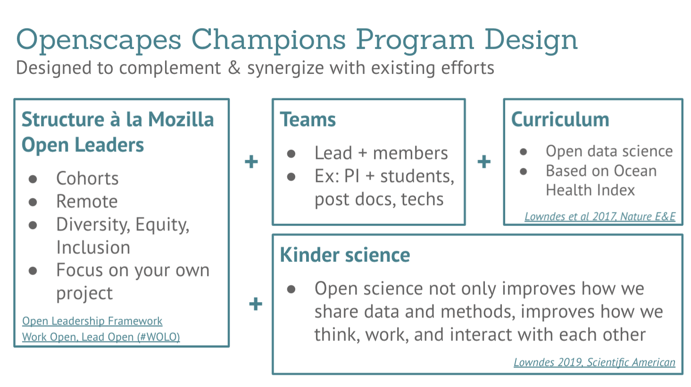

[{fig.alt="Openscapes Champions program slide shows"}](https://docs.google.com/presentation/d/1HGw4P095-lblHiGQHXYidHiVysjrPxuojxTxKtE13vk/edit)

Figure: Openscapes Program design

(More info on what is a team and how to pick teams here: <https://www.openscapes.org/faq>).

2 or 4 months, Cohorts, remote, etc.

[Core 2-month Curriculum, invest for 4months (or reuse!)](https://openscapes.github.io/series/index.html#agendas)
qua